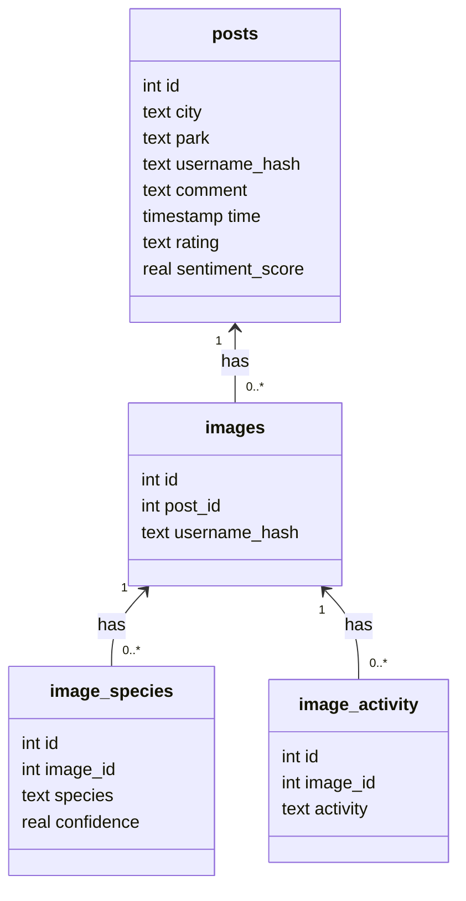

# Database for dashboard

## Dataset

**Source**: Crowdsourced data from Ctrip.com (similar to TripAdvisor)

**Scope**: 720 representative urban parks in 36 cities in China

**Volume**: Around 853,977 pieces of social media texts and 985,025 social media images in total

**Metadata**: Geotags and timestamps

## Database

### Datafolder to SQL database conversion

Instructions for conversion of raw data folders (CSV + image subfolders) into a single SQLite database.

Each *location* folder must contain:

- Exactly one CSV file
- One or more `class_*` subfolders containing images

Example layout:

- `6深圳_携程图像文本/`
  - `2深圳市盐田区大梅沙海滨公园/`
    - `2深圳市盐田区大梅沙海滨公园.csv`
    - `class_0/…`
    - `class_1/…`
    - …

#### 1. Import all location folders under a parent directory

From the project root:

```bash
python3 src/database/csv_to_sql.py <folder_path>
```

For example:

```bash
python3 src/database/csv_to_sql.py 6深圳_携程图像文本
```

### Schema

The SQLite database has two tables: `posts` and `images`.

#### `posts`

| Column           | Type    | Constraints                  | Description                          |
| ---------------- | ------- | --------------------------- | ------------------------------------ |
| `id`             | INTEGER | PRIMARY KEY AUTOINCREMENT   | Post identifier                      |
| `city`           | TEXT    | NOT NULL                    | City name parsed from parent folder  |
| `park`           | TEXT    | NOT NULL                    | Park name parsed from the CSV file   |
| `username`       | TEXT    | NOT NULL                    | User name from CSV                   |
| `comment`        | TEXT    |                             | User comment (may be `NULL`)         |
| `time`           | TEXT    |                             | Timestamp string (may be `NULL`)     |
| `rating`         | TEXT    |                             | Rating string/score (may be `NULL`)  |
| `sentiment_score`| REAL    |                             | Optional sentiment score             |

#### `images`

| Column        | Type    | Constraints                       | Description                         |
| ------------- | ------- | ---------------------------------- | ----------------------------------- |
| `id`          | INTEGER | PRIMARY KEY AUTOINCREMENT         | Image row identifier                |
| `post_id`     | INTEGER | NOT NULL, FK → `posts(id)`        | Post this image belongs to          |
| `image`       | BLOB    | NOT NULL                          | Raw image bytes (e.g. JPEG/PNG)     |

The species labels and activities are now stored in separate tables
(`image_species` and `image_activity`) to allow multiple entries per image.

#### `image_species`

| Column      | Type    | Constraints                       | Description                      |
| ----------- | ------- | ---------------------------------- | -------------------------------- |
| `id`        | INTEGER | PRIMARY KEY AUTOINCREMENT         | Row identifier                   |
| `image_id`  | INTEGER | NOT NULL, FK → `images(id)`       | Associated image                 |
| `species`   | TEXT    | NOT NULL                          | Detected species label           |
| `confidence`| REAL    |                                    | Confidence score (optional)     |

#### `image_activity`

| Column      | Type    | Constraints                       | Description                      |
| ----------- | ------- | ---------------------------------- | -------------------------------- |
| `id`        | INTEGER | PRIMARY KEY AUTOINCREMENT         | Row identifier                   |
| `image_id`  | INTEGER | NOT NULL, FK → `images(id)`       | Associated image                 |
| `activity`  | TEXT    | NOT NULL                          | Detected human activity           |



To inspect the schema and a size summary from the command line:

```bash
python -m src.database.sql
```

Example output:

```bash
Database Summary:
  Posts: 5813 rows (~578.9 KB)
  Images: 7565 rows (~609.8 MB)
  Approx storage for row data: 610.3 MB
```

### Preview post render

You can load a post and render all associated images using Matplotlib and Pillow.

#### 1. Install dependencies

Make sure you have the plotting and image libraries:

```bash
pip install matplotlib pillow
```

**Chinese font (for CJK comments and titles)**

On Debian/Ubuntu:

```bash
sudo apt-get update
sudo apt-get install -y fonts-noto-cjk
```

Then confirm the font path (optional):

```bash
fc-list | grep "NotoSansCJK"
```

Update `FONT_PATH` in `src/database/render_post_with_id.py` if needed:

```python
FONT_PATH = "/usr/share/fonts/opentype/noto/NotoSansCJK-Regular.ttc"
```

#### 2. Render a post by ID

From the project root:

```bash
python -m src.database.render_post_with_id 42 --db data.db
```

Where:

- `42` is the `posts.id` you want to inspect  
- `--db` points to your SQLite file (default: `data.db`)

This will:

- open a Matplotlib window showing all images for the post (up to 3 columns, multiple rows)
- render a title showing City, Park, username, rating, time, and a wrapped comment
- print a copy‑pastable metadata block to the terminal for documentation or analysis.


```

**Chinese font (for CJK comments and titles)**

On Debian/Ubuntu:

```bash
sudo apt-get update
sudo apt-get install -y fonts-noto-cjk
```

Then confirm the font path (optional):

```bash
fc-list | grep "NotoSansCJK"
```

Update `FONT_PATH` in `src/database/render_post_with_id.py` if needed:

```python
FONT_PATH = "/usr/share/fonts/opentype/noto/NotoSansCJK-Regular.ttc"
```

#### 2. Render a post by ID

From the project root:

```bash
python -m src.database.render_post_with_id 42 --db data.db
```

Where:

- `42` is the `posts.id` you want to inspect  
- `--db` points to your SQLite file (default: `data.db`)

This will:

- open a Matplotlib window showing all images for the post (up to 3 columns, multiple rows)
- render a title showing City, Park, username, rating, time, and a wrapped comment
- print a copy‑pastable metadata block to the terminal for documentation or analysis.
