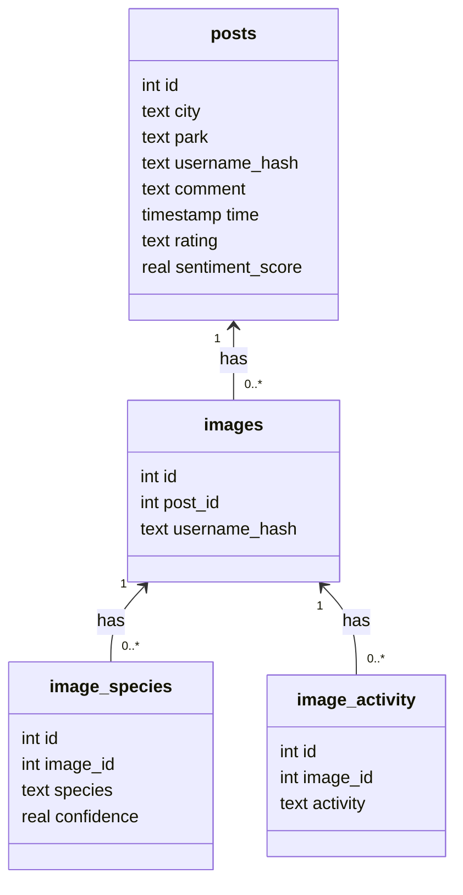

# Database for dashboard

## Dataset

**Source**: Crowdsourced data from Ctrip.com (similar to TripAdvisor)

**Scope**: 720 representative urban parks in 36 cities in China

**Volume**: Around 853,977 pieces of social media texts and 985,025 social media images in total

**Metadata**: Geotags and timestamps

## Database

### Data Ingestion into PostgreSQL

The orchestrator imports CSV files and images into PostgreSQL. The CSV files must contain columns like `city`, `park`, `username`, `comment`, `timestamp`, `rating`, and optionally `image` (relative path).

#### 1. Upload CSV files with posts

Place CSV files in `data/csvs/` on the host and run:

```bash
docker-compose run --rm orchestrator \
  --db-dsn "dbname=mydb user=myuser password=mypass host=postgres port=5432" \
  upload-posts --csv-dir /data/csvs --image-root /data/images
```

#### 2. Upload image folders separately

Place images in `data/images/` or another folder and run:

```bash
docker-compose run --rm orchestrator \
  --db-dsn "dbname=mydb user=myuser password=mypass host=postgres port=5432" \
  upload-images --folders /data/images --image-root /data/images
```

Images are copied into a managed directory (default `data/images/`) using their numeric image ID as the filename. **PostgreSQL does not store the file paths or image blobs—only numeric IDs and optional username hashes.**

### Schema

PostgreSQL stores post and image metadata in normalized tables. Images themselves are stored on disk, not in the database.

#### `posts`

| Column           | Type    | Constraints                  | Description                          |
| ---------------- | ------- | --------------------------- | ------------------------------------ |
| `id`             | INTEGER | PRIMARY KEY AUTOINCREMENT   | Post identifier                      |
| `city`           | TEXT    | NOT NULL                    | City name parsed from parent folder  |
| `park`           | TEXT    | NOT NULL                    | Park name parsed from the CSV file   |
| `username_hash`  | TEXT    | NOT NULL                    | SHA256 hash of username (privacy)    |
| `comment`        | TEXT    |                             | User comment (may be `NULL`)         |
| `time`           | TEXT    |                             | Timestamp string (may be `NULL`)     |
| `rating`         | TEXT    |                             | Rating string/score (may be `NULL`)  |
| `sentiment_score`| REAL    |                             | Optional sentiment score             |

#### `images`

| Column        | Type    | Constraints                       | Description                         |
| ------------- | ------- | ---------------------------------- | ----------------------------------- |
| `id`          | INTEGER | PRIMARY KEY AUTOINCREMENT         | Image row identifier                |
| `post_id`     | INTEGER | NOT NULL, FK → `posts(id)`        | Post this image belongs to          |
| `username_hash` | TEXT |                                    | Optional username hash from filename|

The species labels and activities are now stored in separate tables
(`image_species` and `image_activity`) to allow multiple entries per image.

#### `image_species`

| Column      | Type    | Constraints                       | Description                      |
| ----------- | ------- | ---------------------------------- | -------------------------------- |
| `id`        | INTEGER | PRIMARY KEY AUTOINCREMENT         | Row identifier                   |
| `image_id`  | INTEGER | NOT NULL, FK → `images(id)`       | Associated image                 |
| `species`   | TEXT    | NOT NULL                          | Detected species label           |
| `confidence`| REAL    |                                    | Confidence score (optional)     |

#### `image_activity`

| Column      | Type    | Constraints                       | Description                      |
| ----------- | ------- | ---------------------------------- | -------------------------------- |
| `id`        | INTEGER | PRIMARY KEY AUTOINCREMENT         | Row identifier                   |
| `image_id`  | INTEGER | NOT NULL, FK → `images(id)`       | Associated image                 |
| `activity`  | TEXT    | NOT NULL                          | Detected human activity           |



To connect to the PostgreSQL database directly:

```bash
psql -U myuser -d mydb -h localhost -p 5432
```

Then run queries like:

```sql
SELECT COUNT(*) FROM posts;
SELECT COUNT(*) FROM images;
SELECT * FROM image_species WHERE image_id = 42;
```

### Preview post render

You can load a post and render all associated images using Matplotlib and Pillow.

#### 1. Install dependencies

Make sure you have the plotting and image libraries:

```bash
pip install matplotlib pillow
```

**Chinese font (for CJK comments and titles)**

On Debian/Ubuntu:

```bash
sudo apt-get update
sudo apt-get install -y fonts-noto-cjk
```

Then confirm the font path (optional):

```bash
fc-list | grep "NotoSansCJK"
```

Update `FONT_PATH` in `src/database/render_post_with_id.py` if needed:

```python
FONT_PATH = "/usr/share/fonts/opentype/noto/NotoSansCJK-Regular.ttc"
```

#### 2. Render a post by ID

From the project root:

```bash
python -m src.database.render_post_with_id 42 --db-dsn "dbname=mydb user=myuser password=mypass host=postgres port=5432" --image-root ./data/images
```

Where:

- `42` is the `posts.id` you want to inspect  
- `--db-dsn` points to your PostgreSQL instance
- `--image-root` points to the directory where images are stored (default: `./data/images`)

This will:

- open a Matplotlib window showing all images for the post (up to 3 columns, multiple rows)
- render a title showing City, Park, username hash, rating, time, and a wrapped comment
- print a copy‑pastable metadata block to the terminal for documentation or analysis.

**Chinese font (for CJK comments and titles)**

On Debian/Ubuntu:

```bash
sudo apt-get update
sudo apt-get install -y fonts-noto-cjk
```

Then confirm the font path (optional):

```bash
fc-list | grep "NotoSansCJK"
```

Update `FONT_PATH` in `src/database/render_post_with_id.py` if needed:

```python
FONT_PATH = "/usr/share/fonts/opentype/noto/NotoSansCJK-Regular.ttc"
```
