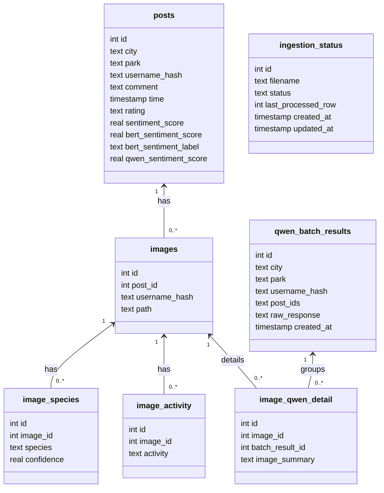

# Database for dashboard

## Dataset

**Source**: Crowdsourced data from Ctrip.com (similar to TripAdvisor)

**Scope**: 720 representative urban parks in 36 cities in China

**Volume**: Around 853,977 pieces of social media texts and 985,025 social media images in total

**Metadata**: Geotags and timestamps

## Database

### Data Ingestion into PostgreSQL

The orchestrator imports CSV files and images into PostgreSQL. The CSV files must contain columns like `city`, `park`, `username`, `comment`, `timestamp`, `rating`, and optionally `image` (relative path).

#### 1. Upload CSV files with posts

Place CSV files in `data/csvs/` on the host and run:

```bash
docker-compose run --rm orchestrator \
  --db-dsn "dbname=mydb user=myuser password=mypass host=postgres port=5432" \
  upload-posts --csv-dir /data/csvs --image-root /data/images
```

#### 2. Upload image folders separately

Place images in `data/images/` or another folder and run:

```bash
docker-compose run --rm orchestrator \
  --db-dsn "dbname=mydb user=myuser password=mypass host=postgres port=5432" \
  upload-images --folders /data/images --image-root /data/images
```

Images are copied into a managed directory (default `data/images/`) using their numeric image ID as the filename. PostgreSQL stores metadata only (IDs, optional path/labels/scores), not image binary blobs.

### Schema

PostgreSQL stores post/image/Qwen metadata in normalized tables. Image binaries remain on disk.

#### `posts`

| Column                 | Type      | Constraints     | Description |
| ---------------------- | --------- | --------------- | ----------- |
| `id`                   | SERIAL    | PRIMARY KEY     | Post identifier |
| `city`                 | TEXT      | NOT NULL        | City name |
| `park`                 | TEXT      | NOT NULL        | Park name |
| `username_hash`        | TEXT      | NOT NULL        | SHA256 hash for privacy |
| `comment`              | TEXT      |                 | User comment |
| `time`                 | TIMESTAMP |                 | Comment timestamp |
| `rating`               | TEXT      |                 | Rating value |
| `sentiment_score`      | REAL      |                 | Legacy/general sentiment score |
| `bert_sentiment_score` | REAL      |                 | Bert sentiment score |
| `bert_sentiment_label` | TEXT      |                 | Bert label |
| `qwen_sentiment_score` | REAL      |                 | Qwen sentiment score |

#### `images`

| Column          | Type    | Constraints                    | Description |
| --------------- | ------- | ------------------------------ | ----------- |
| `id`            | SERIAL  | PRIMARY KEY                    | Image identifier |
| `post_id`       | INTEGER | FK → `posts(id)`, nullable     | Linked post (optional for standalone uploads) |
| `username_hash` | TEXT    |                                | Optional hash parsed from image/file context |
| `path`          | TEXT    |                                | Stored source/relative image path metadata |

#### `image_species`

| Column       | Type    | Constraints                    | Description |
| ------------ | ------- | ------------------------------ | ----------- |
| `id`         | SERIAL  | PRIMARY KEY                    | Row identifier |
| `image_id`   | INTEGER | NOT NULL, FK → `images(id)`    | Associated image |
| `species`    | TEXT    | NOT NULL                       | Detected species label |
| `confidence` | REAL    |                                | Confidence score |

#### `image_activity`

| Column     | Type    | Constraints                    | Description |
| ---------- | ------- | ------------------------------ | ----------- |
| `id`       | SERIAL  | PRIMARY KEY                    | Row identifier |
| `image_id` | INTEGER | NOT NULL, FK → `images(id)`    | Associated image |
| `activity` | TEXT    | NOT NULL                       | Detected human activity |

#### `qwen_batch_results`

| Column                                              | Type      | Constraints | Description |
| --------------------------------------------------- | --------- | ----------- | ----------- |
| `id`                                                | SERIAL    | PRIMARY KEY | Batch result identifier |
| `city`                                              | TEXT      |             | Batch city |
| `park`                                              | TEXT      |             | Batch park |
| `username_hash`                                     | TEXT      |             | User hash for grouped batch |
| `post_ids`                                          | TEXT      |             | JSON-encoded list of post IDs in this batch |
| `raw_response`                                      | TEXT      |             | Raw model output |
| `emotions`                                          | TEXT      |             | JSON/text emotions list |
| `influence_of_emotions`                             | TEXT      |             | Narrative explanation |
| `text_species_mentions`                             | TEXT      |             | Species entities from text |
| `feeling_correlated_to_text_species`                | TEXT      |             | Feeling correlation for species mentions |
| `text_activities_or_facilities`                     | TEXT      |             | Activity/facility mentions from text |
| `feeling_correlated_to_text_activities_or_facilities` | TEXT   |             | Feeling correlation for activities/facilities |
| `comment_sentiment_score`                           | REAL      |             | Batch comment sentiment score |
| `association_likelihood`                            | REAL      |             | Estimated likelihood metric |
| `association_summary`                               | TEXT      |             | Summary text |
| `created_at`                                        | TIMESTAMP | DEFAULT NOW() | Creation timestamp |

#### `image_qwen_detail`

| Column            | Type    | Constraints                                      | Description |
| ----------------- | ------- | ------------------------------------------------ | ----------- |
| `id`              | SERIAL  | PRIMARY KEY                                      | Detail row identifier |
| `image_id`        | INTEGER | NOT NULL, FK → `images(id)`                      | Linked image |
| `batch_result_id` | INTEGER | FK → `qwen_batch_results(id)`, ON DELETE SET NULL | Optional parent batch |
| `image_summary`   | TEXT    |                                                  | Image-level summary |
| `visible_species` | TEXT    |                                                  | JSON-encoded visible species |
| `landscape_elements` | TEXT |                                                  | JSON-encoded landscape elements |
| `human_activities` | TEXT   |                                                  | JSON-encoded activities |

#### `ingestion_status`

| Column               | Type      | Constraints            | Description |
| -------------------- | --------- | ---------------------- | ----------- |
| `id`                 | SERIAL    | PRIMARY KEY            | Row identifier |
| `filename`           | TEXT      | UNIQUE                 | CSV/folder path tracked by orchestrator |
| `status`             | TEXT      |                        | Pipeline status (`processing`, `done`, etc.) |
| `last_processed_row` | INTEGER   |                        | Resume checkpoint |
| `created_at`         | TIMESTAMP | DEFAULT NOW()          | Initial insert time |
| `updated_at`         | TIMESTAMP |                        | Last status update |



To connect to the PostgreSQL database directly:

```bash
psql -U myuser -d mydb -h localhost -p 5432
```

Then run queries like:

```sql
SELECT COUNT(*) FROM posts;
SELECT COUNT(*) FROM images;
SELECT * FROM image_species WHERE image_id = 42;
SELECT id, city, park, created_at FROM qwen_batch_results ORDER BY created_at DESC LIMIT 10;
SELECT image_id, image_summary FROM image_qwen_detail WHERE batch_result_id = 1;
SELECT filename, status, last_processed_row FROM ingestion_status ORDER BY updated_at DESC NULLS LAST;
```

### Preview post render

You can load a post and render all associated images using Matplotlib and Pillow.

#### 1. Install dependencies

Make sure you have the plotting and image libraries:

```bash
pip install matplotlib pillow
```

**Chinese font (for CJK comments and titles)**

On Debian/Ubuntu:

```bash
sudo apt-get update
sudo apt-get install -y fonts-noto-cjk
```

Then confirm the font path (optional):

```bash
fc-list | grep "NotoSansCJK"
```

Update `FONT_PATH` in `src/database/render_post_with_id.py` if needed:

```python
FONT_PATH = "/usr/share/fonts/opentype/noto/NotoSansCJK-Regular.ttc"
```

#### 2. Render a post by ID

From the project root:

```bash
python -m src.database.render_post_with_id 42 --db-dsn "dbname=mydb user=myuser password=mypass host=postgres port=5432" --image-root ./data/images
```

Where:

- `42` is the `posts.id` you want to inspect  
- `--db-dsn` points to your PostgreSQL instance
- `--image-root` points to the directory where images are stored (default: `./data/images`)

This will:

- open a Matplotlib window showing all images for the post (up to 3 columns, multiple rows)
- render a title showing City, Park, username hash, rating, time, and a wrapped comment
- print a copy‑pastable metadata block to the terminal for documentation or analysis.

**Chinese font (for CJK comments and titles)**

On Debian/Ubuntu:

```bash
sudo apt-get update
sudo apt-get install -y fonts-noto-cjk
```

Then confirm the font path (optional):

```bash
fc-list | grep "NotoSansCJK"
```

Update `FONT_PATH` in `src/database/render_post_with_id.py` if needed:

```python
FONT_PATH = "/usr/share/fonts/opentype/noto/NotoSansCJK-Regular.ttc"
```
