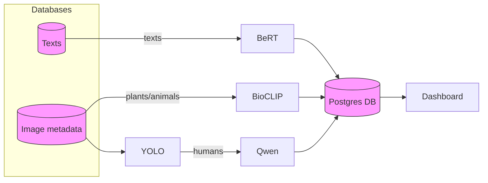

# Pipeline

## Data Flow Diagram



### Orchestrator

A new Python module (`src/pipeline/orchestrator.py`) ties everything together.  It
is capable of:

> **Note:** the original project used a separate SQLite database for
> ingestion.  That database is now obsolete; the orchestrator works exclusively
> with the single PostgreSQL instance described below.  SQLite support remains
> in the `database` package only for backwards-compatibility in tests and
> import utilities.

* ingesting CSV files and tracking their progress in a dedicated `ingestion_status`
  table; each filename is updated with `pending`/`processing`/`done`/`failed`
  and the last row number that was imported;
* ingesting arbitrary image folders (recursively), storing only the file path
  and an optional username hash derived from the filename;
* calling the `BioClipModel` in batches by re-opening the files from disk and
  updating the `images` table with species/confidence;
* invoking the sentiment analyzer on text and writing a `sentiment_score` into
  `posts`; posts also record a `username_hash` for privacy along with city,
  park, rating, timestamp, and original text;
* grouping rows by `(city, park, username)` and executing Qwen batches; the
  resulting human activities are persisted back to the `activity` column of
  the corresponding image rows.

The database schema now reflects both hashed usernames and the ingestion status
mechanism described earlier.

### Dockerized model services

To decouple analysis from the orchestrator we also provide lightweight HTTP
services for each model.  These services are packaged as Docker images and
live in sibling subdirectories of the model code:

* `src/models/BioClip-Container` – exposes `/analyze_images`
* `src/models/Bert-Container` (sentiment/BERT) – exposes `/analyze_posts`
* `src/models/Qwen-Container` – exposes `/analyze_users`

Each service wraps the existing Python classes, accepts a JSON payload, and
returns results in the same format used by the orchestrator's ``service_url``
mechanism.  When running the orchestrator you may either run the models
locally (the default) or point at one or more of these containers using the
``bio_service_url``, ``sentiment_service_url`` and ``qwen_service_url``
arguments.

Results are recorded in Postgres but not in the images table itself; species
labels and activity tags live in separate ``image_species`` and
``image_activity`` tables respectively so that each image may accumulate
multiple entries over time.

The BioClip container additionally ships a command‑line analyzer (``python -m
models.BioClip.analyzer``) which can be used directly inside the image to poll
a Postgres database and score pending images.  This allows the same
container to function either as a web service or as a standalone worker.

#### Building and running

```sh
# build all three images (from repo root)
cd src/models/BioClip-Container && docker build -t bioclip-service .
cd ../Qwen-Container && docker build -t qwen-service .
cd ../Bert-Container && docker build -t bert-service .

# run them on the default ports
docker run -p 5000:5000 bioclip-service
docker run -p 5001:5000 bert-service
docker run -p 5002:5000 qwen-service
```

You can customize the behavior via environment variables defined in each
container's ``app.py`` (e.g. `SPECIES_TOKENS_PATH`, `SENTIMENT_MODEL`,
`OPENAI_API_KEY`, etc.).

Once the services are running you can invoke the orchestrator like this:

```sh
python -m pipeline.orchestrator analyze \
    --image-root /data/images --db-dsn "dbname=mydb" \
    --bio-service-url http://localhost:5000 \
    --sentiment-service-url http://localhost:5001 \
    --qwen-service-url http://localhost:5002
```

Alternatively you can run the entire orchestrator inside its own container
(which already bundles all Python dependencies):

```sh
cd src/pipeline/Orchestrator-Container
docker build -t pipeline-orchestrator .

docker run --rm -v /data:/data pipeline-orchestrator upload-posts \
    --csv-dir /data/csvs --image-root /data/images \
    --db-dsn "dbname=mydb" \
    --bio-service-url http://bio:5000 \
    --sentiment-service-url http://bert:5000 \
    --qwen-service-url http://qwen:5000
```

The orchestrator will batch inputs, POST them to the appropriate service, and
persist the returned results back into Postgres exactly as it would with the
local model implementations.

You can interact with the orchestrator via a small CLI that supports three
subcommands:

```sh
# ingest posts from CSVs (optional image root for relative paths)
python -m pipeline.orchestrator upload-posts --csv-dir /path/to/csvs \
    [--image-root /path/to/images] --db-dsn "dbname=..."

# ingest raw image folders
python -m pipeline.orchestrator upload-images --folders /path/one /path/two \
    [--image-root /path/to/store] --db-dsn "dbname=..."

# run analysis on whatever data has been imported
python -m pipeline.orchestrator analyze \
    [--batch-size 1000] [--max-batches 10] [--workers 4] \
    [--image-root /path/to/images] --db-dsn "dbname=..."
```

Each command updates `ingestion_status` automatically so you can safely
re-run failed imports or continue a long job.

The same module may also be imported and driven programmatically, allowing for
more advanced concurrency strategies (e.g. multiple workers each fetching the
next unprocessed batch).

> **Storage details:**  the database no longer contains binary image data or
> file paths.  During ingestion the orchestrator copies each image into a
> user-specified ``image_root`` (default ``data/images``) and stores only the
> numeric id and optional username hash.  When analyzing it looks up files by
> id under the same directory.  This keeps the Postgres instance lean and
> avoids persisting any sensitive paths or blobs.
