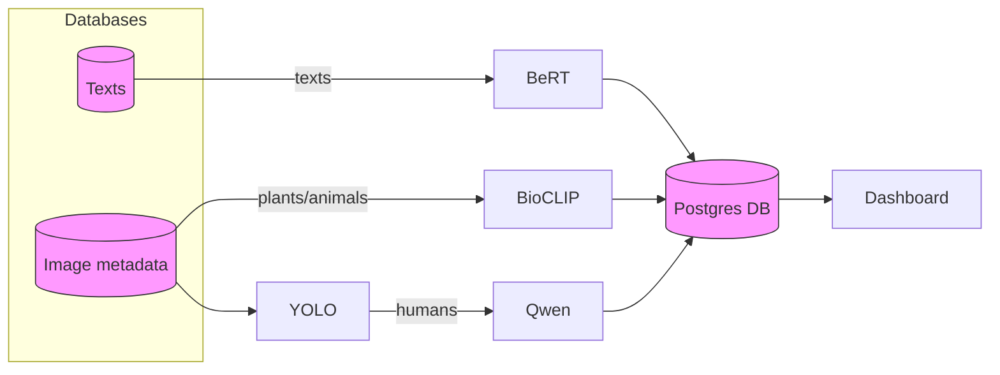

# Pipeline

## Data Flow Diagram



### Orchestrator

A new Python module (`src/pipeline/orchestrator.py`) ties everything together.  It
is capable of:

> **Note:** the original project used a separate SQLite database for
> ingestion.  That database is now obsolete; the orchestrator works exclusively
> with the single PostgreSQL instance described below.  SQLite support remains
> in the `database` package only for backwards-compatibility in tests and
> import utilities.

* ingesting CSV files and tracking their progress in a dedicated `ingestion_status`
  table; each filename is updated with `pending`/`processing`/`done`/`failed`
  and the last row number that was imported;
* ingesting arbitrary image folders (recursively), storing only the file path
  and an optional username hash derived from the filename;
* calling the `BioClipModel` in batches by re-opening the files from disk and
  writing species/confidence to `image_species`;
* invoking the sentiment analyzer on text and writing Bert outputs into
  `posts`; posts also record a `username_hash` for privacy along with city,
  park, rating, timestamp, and original text;
* invoking the Qwen service on individual images and comments independently; the
  resulting outputs (including structured properties and human activities) are persisted back to
  the corresponding `post_qwen_detail` and `image_qwen_detail` tables.

The database schema now reflects both hashed usernames and the ingestion status
mechanism described earlier.

In addition, each model path has per-row execution status tracking:

* posts/Bert: `bert_status` (`pending` -> `processing` -> `ready` or `failed`)
* posts/Qwen: `qwen_status` (`pending` -> `processing` -> `ready` or `failed`)
* images/BioClip: `bioclip_status` (`pending` -> `processing` -> `ready` or `failed`)
* images/Qwen: `qwen_status` (`pending` -> `processing` -> `ready` or `failed`)

If any row remains in `processing` for over 1 hour, it is returned to `pending`
before the next analyzer claim.

### Dockerized model services

To decouple analysis from the orchestrator we also provide lightweight HTTP
services for each model.  These services are packaged as Docker images and
live in sibling subdirectories of the model code:

* `src/models/BioClip-Container` – exposes `/analyze_images`
* `src/models/Bert-Container` (sentiment/BERT) – exposes `/analyze_posts`
* `src/models/Qwen-Container` – exposes `/analyze_images` and `/analyze_users`

Each service wraps the existing Python classes, accepts a JSON payload, and
returns results in the same format used by the orchestrator's ``service_url``
mechanism.  When running the orchestrator you may either run the models
locally (the default) or point at one or more of these containers using the
``bio_service_url``, ``sentiment_service_url`` and ``qwen_service_url``
arguments.

Results are recorded in Postgres but not in the images table itself; BioCLIP
species labels live in ``image_species`` while Qwen-image structured outputs
are consolidated in ``image_qwen_detail`` (one row per image).

The BioClip container additionally ships a command‑line analyzer (``python -m
models.BioClip.analyzer``) which can be used directly inside the image to poll
a Postgres database and score pending images.  This allows the same
container to function either as a web service or as a standalone worker.

#### Building and running

```sh
# build all three images (from repo root)
cd src/models/BioClip-Container && docker build -t bioclip-service .
cd ../Qwen-Container && docker build -t qwen-service .
cd ../Bert-Container && docker build -t bert-service .

# run them on the default ports
docker run -p 5000:5000 bioclip-service
docker run -p 5001:5000 bert-service
docker run -p 5002:5000 qwen-service
```

You can customize the behavior via environment variables defined in each
container's ``app.py`` (e.g. `SPECIES_TOKENS_PATH`, `SENTIMENT_MODEL`,
`OPENAI_API_KEY`, etc.).

Once the services are running you can invoke the orchestrator like this:

```sh
python -m pipeline.orchestrator --db-dsn "dbname=mydb" \
  upload --csv-folder /data/csvs --image-folder /data/images

python -m pipeline.orchestrator --db-dsn "dbname=mydb" \
  analyze \
  --bio-service-url http://localhost:5000 \
  --bert-service-url http://localhost:5001 \
  --qwen-service-url http://localhost:5002
```

Alternatively you can run the entire orchestrator inside its own container
(which already bundles all Python dependencies):

```sh
cd /path/to/repo
docker build -f src/pipeline/Orchestrator-Container/Dockerfile -t pipeline-orchestrator .

docker run --rm -v /data:/data pipeline-orchestrator \
  --db-dsn "dbname=mydb" \
  upload --csv-folder /data/csvs --image-folder /data/images \
  --image-folders /data/extra-images

# when the mounted folder name is generic (for example /input), pass the city explicitly
docker run --rm -v /input:/input pipeline-orchestrator \
  --db-dsn "dbname=mydb" \
  upload --csv-folder /input/36Chengdu --image-folder /input/36Chengdu --city Chengdu

docker run --rm -v /data:/data pipeline-orchestrator \
  --db-dsn "dbname=mydb" \
  analyze \
  --bio-service-url http://bio:5000 \
  --bert-service-url http://bert:5000 \
  --qwen-service-url http://qwen:5000
```

The orchestrator will batch inputs, POST them to the appropriate service, and
persist the returned results back into Postgres exactly as it would with the
local model implementations.

You can interact with the orchestrator via CLI subcommands:

```sh
# ingest posts and images in one step
python -m pipeline.orchestrator --db-dsn "dbname=..." \
  upload --csv-folder /data/csvs --image-folder /data/images \
  [--image-folders /extra/one /extra/two] [--city CITY]

# run analysis on whatever data has been imported
python -m pipeline.orchestrator --db-dsn "dbname=..." analyze \
    [--batch-size 1000] [--max-batches 10] [--workers 4] \
  --bio-service-url http://localhost:5000 \
  --bert-service-url http://localhost:5001 \
  --qwen-service-url http://localhost:5002
```

Each command updates `ingestion_status` automatically so you can safely
re-run failed imports or continue a long job.

### DB-less JSON mode

For quick experiments or CI-friendly runs the orchestrator can run without a
database and instead write a single JSON file containing the collected
`posts`, `images` and analysis outputs. To enable this mode pass
`--output-json /path/to/results.json` on the orchestrator command line. When
`--output-json` is present the orchestrator will not open database
connections; instead it accumulates results in-memory and writes the JSON at
the end of the run.

Example:

```sh
# ingest posts into results.json (no DB used)
python -m pipeline.orchestrator --output-json /tmp/results.json \
  upload --csv-folder /data/csvs --image-folder /data/images

# run analysis and store model outputs in the same (or a new) JSON file
python -m pipeline.orchestrator --output-json /tmp/results.json analyze \
  --bio-service-url http://localhost:5000 --bert-service-url http://localhost:5001 --qwen-service-url http://localhost:5002
```

The JSON schema is intentionally simple and includes top-level keys such as
`posts`, `images`, `image_analysis`, `post_sentiment`, `image_qwen_detail`
and `post_qwen_detail` to mirror the data the pipeline would normally
persist to Postgres.

The same module may also be imported and driven programmatically, allowing for
more advanced concurrency strategies (e.g. multiple workers each fetching the
next unprocessed batch).

> **Storage details:** the database does not store image binaries. During
> ingestion the orchestrator stores original file locations in `images.path`.
> Analysis re-opens those original files directly, so no image-copy stage is
> required.
