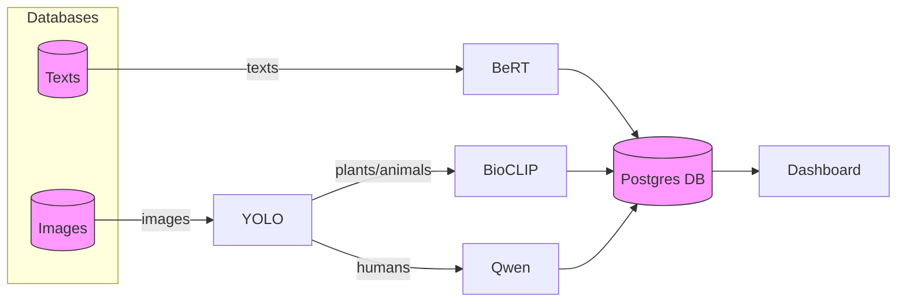

# Pipeline

## Data Flow Diagram

```mermaid
flowchart LR
 subgraph Databases
  TextDB[(Texts)]
  ImageDB[(Images)]
 end

 TextDB -->|texts| BERT[BeRT]
 BERT -->Postgres[(Postgres DB)]

 ImageDB -->|images| YOLO[YOLO]
 YOLO -->|plants/animals| BioCLIP[BioCLIP]
 YOLO -->|humans| Qwen[Qwen]

 BioCLIP -->Postgres
 Qwen -->Postgres

 Postgres -->Dashboard[Dashboard]

 classDef db fill:#f9f,stroke:#333,stroke-width:1px;
 class TextDB,ImageDB,Postgres db;
```
