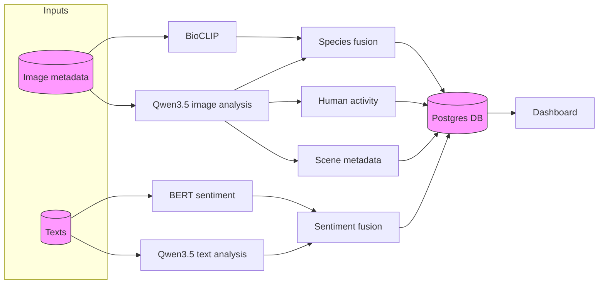

# Pipeline


## Data Flow Diagram



### Orchestrator
A new Python module (`src/pipeline/orchestrator.py`) ties everything together.  It
is capable of:

* ingesting CSV files and tracking their progress in a dedicated `ingestion_status`
  table; each filename is updated with `pending`/`processing`/`done`/`failed`
  and the last row number that was imported;
* ingesting arbitrary image folders (recursively), storing only the file path
  and an optional username hash derived from the filename;
* calling the `BioClipModel` in batches by re-opening the files from disk and
  updating the `images` table with species/confidence;
* invoking the sentiment analyzer on text and writing a `sentiment_score` into
  `posts`; posts also record a `username_hash` for privacy along with city,
  park, rating, timestamp, and original text;
* invoking the Qwen service on individual images and comments independently; the
  resulting outputs (including structured properties and human activities) are persisted back to
  the corresponding `post_qwen_detail` and `image_qwen_detail` tables.

The database schema now reflects both hashed usernames and the ingestion status
mechanism described earlier.

Inside the orchestrator, the planned `analyze` flow is:

1. **Ingestion**
   * `upload-posts` writes post metadata and image links.
   * `upload-images` writes standalone image metadata.

2. **BioCLIP first pass on images**
   * `Pipeline.analyze_images()` fetches unprocessed images.
   * BioCLIP produces candidate plant/animal labels and confidence values.
   * These outputs act as the structured species baseline.

3. **Qwen3.5 image pass on the same images**
   * The orchestrator sends each image to the Qwen image prompt contract from `examples/images.md`.
   * Qwen returns:
     * `image_summary`
     * `visible_species_in_image`
     * `landscape_elements`
     * `human_activities_in_image`
     * `plants_detected`
     * `animals_detected`
     * `human_activities_detected`

4. **Species fusion stage**
   * BioCLIP and Qwen outputs are normalized to Latin scientific names where possible.
   * Similarity between both model outputs is computed.
   * Final fused species confidence is derived from:
     * BioCLIP confidence,
     * Qwen confidence,
     * taxonomic / label similarity.

5. **Human activity stage**
   * Human activity recognition relies on Qwen only.
   * Final activity labels are written directly from the Qwen image response.

6. **BERT first pass on comments**
   * `Pipeline.analyze_posts()` runs BERT over each comment.
   * BERT provides a fast and stable sentiment baseline.

7. **Qwen3.5 comment pass**
   * The orchestrator sends each comment to the Qwen text prompt contract from `examples/comment.md`.
   * Qwen returns:
     * `emotions`
     * `influence_of_emotions`
     * `text_species_mentions`
     * `feeling_correlated_to_text_species`
     * `text_activities_or_facilities`
     * `feeling_correlated_to_text_activities_or_facilities`
     * `comment_sentiment`

8. **Sentiment fusion stage**
   * BERT and Qwen sentiment scores are compared.
   * The final post-level sentiment score is a fused value.
   * Agreement between the two models is used as confidence / consistency signal.

## Orchestrator architecture

To support the notebook-style logic in production, the orchestrator has the following responsibilities:

### Image-side methods

* `analyze_images()`
  * produce BioCLIP species candidates;
* `run_qwen_image_analysis()`
  * run the `images.md` prompt per image;
* `fuse_species_results()`
  * merge BioCLIP + Qwen species outputs into final species records;
* `persist_human_activity_results()`
  * persist Qwen-only human activity labels.

### Text-side methods

* `analyze_posts()`
  * produce BERT sentiment baseline;
* `run_qwen_comment_analysis()`
  * run the `comment.md` prompt per post/comment;
* `fuse_sentiment_results()`
  * merge BERT + Qwen sentiment into final post sentiment.

## Service/API split

Under the target architecture, the Qwen service exposes two logical inference modes:

* `/analyze_images`
  * input: one or more images;
  * prompt contract: `examples/images.md`;
  * used for object/scene understanding, species verification, and human activity.

* `/analyze_comments`
  * input: one or more comments;
  * prompt contract: `examples/comment.md`;
  * used for text analysis and Qwen sentiment.

## CLI Configuration

The orchestrator supports separate configuration for image and text prompts, for example:

* `--qwen-image-instruction-file`
* `--qwen-comment-instruction-file`
* `--qwen-image-model`
* `--qwen-text-model`

If the deployment uses one OpenAI-compatible endpoint for both tasks, the model names may still point to the same backend, but the prompt contracts remain separate.

## Persistence strategy

The database roles in the target design are:

* `post_qwen_detail`
  * stores structured text analysis, emotional influences, and identified textual entities directly to the post.
* `image_qwen_detail`
  * stores consolidated Qwen image-side structured outputs such as summary, visible species, landscape, human activities, and structured detections (`plants_detected`, `animals_detected`, `human_activities_detected`);
* `image_species`
  * stores BioCLIP/fused species result, not Qwen-only raw output;
* `posts.bert_sentiment_score`
  * stores BERT baseline;
* `posts.qwen_sentiment_score`
  * stores Qwen sentiment;
* `posts.sentiment_score`
  * stores the fused final sentiment score.

## Dockerized model services

To decouple analysis from the orchestrator we provide lightweight HTTP services for each model. These services are packaged as Docker images and live in sibling subdirectories of the model code:

* `src/models/BioClip-Container` – species candidate generation
* `src/models/Bert-Container` – baseline sentiment scoring
* `src/models/Qwen-Container` – planned image/comment/user Qwen inference service

Each service wraps the existing Python classes, accepts a JSON payload, and returns results in the same format used by the orchestrator service URL mechanism.

#### Building and running

```sh
# build all three images (from repo root)
cd src/models/BioClip-Container && docker build -t bioclip-service .
cd ../Qwen-Container && docker build -t qwen-service .
cd ../Bert-Container && docker build -t bert-service .

# run Qwen3.5  background serve(need to customize)

sudo docker run --runtime nvidia --gpus all \
    -e HF_TOKEN \
    -e LD_LIBRARY_PATH="/usr/local/nvidia/lib64:/usr/lib/x86_64-linux-gnu:/usr/local/cuda/lib64" \
    -v ~/.cache/huggingface:/root/.cache/huggingface \
    --ipc=host \
    -p 8000:8000 \
    vllm/vllm-openai:latest \
    Qwen/Qwen3-VL-8B-Instruct-FP8 \
    --max-model-len 8192 \
    --gpu-memory-utilization 0.85 \
    --kv-cache-dtype fp8 \
    --limit-mm-per-prompt.video 0

# run them on the default ports
docker run -p 5000:5000 bioclip-service
docker run -p 5001:5000 bert-service
docker run -p 5002:5000 qwen-service
```

You can customize the behavior via environment variables defined in each
container's ``app.py`` (e.g. `SPECIES_TOKENS_PATH`, `SENTIMENT_MODEL`,
`OPENAI_API_KEY`, etc.).

Once the services are running you can invoke the orchestrator like this:

```sh
python -m pipeline.orchestrator analyze \
    --city-folder /data/6Shenzhen --db-dsn "dbname=mydb" \
    --bio-service-url http://localhost:5000 \
    --sentiment-service-url http://localhost:5001 \
    --qwen-service-url http://localhost:5002
```

Alternatively you can run the entire orchestrator inside its own container
(which already bundles all Python dependencies):

```sh
cd src/pipeline/Orchestrator-Container
docker build -t pipeline-orchestrator .

docker run --rm -v /data:/data pipeline-orchestrator upload-posts \
    --city-folder /data/6Shenzhen \
    --db-dsn "dbname=mydb" \
    --bio-service-url http://bio:5000 \
    --sentiment-service-url http://bert:5000 \
    --qwen-service-url http://qwen:5000
```

The orchestrator will batch inputs, POST them to the appropriate service, and
persist the returned results back into Postgres exactly as it would with the
local model implementations.

You can interact with the orchestrator via a small CLI that supports three
subcommands:

```sh
# ingest posts from CSVs (optional image root for relative paths)
python -m pipeline.orchestrator upload-posts --city-folder /data/6Shenzhen --db-dsn "dbname=..."

# ingest raw image folders
python -m pipeline.orchestrator upload-images --folders /path/one /path/two \
    [--image-root /path/to/store] --db-dsn "dbname=..."

# run analysis on whatever data has been imported
python -m pipeline.orchestrator analyze \
    [--batch-size 1000] [--max-batches 10] [--workers 4] \
    [--image-root /path/to/images] --db-dsn "dbname=..."
```

Each command updates `ingestion_status` automatically so you can safely
re-run failed imports or continue a long job.

The same module may also be imported and driven programmatically, allowing for
more advanced concurrency strategies (e.g. multiple workers each fetching the
next unprocessed batch).

> **Storage details:**  the database no longer contains binary image data or
> file paths.  During ingestion the orchestrator copies each image into a
> user-specified ``image_root`` (default ``data/images``) and stores only the
> numeric id and optional username hash.  When analyzing it looks up files by
> id under the same directory.  This keeps the Postgres instance lean and
> avoids persisting any sensitive paths or blobs.